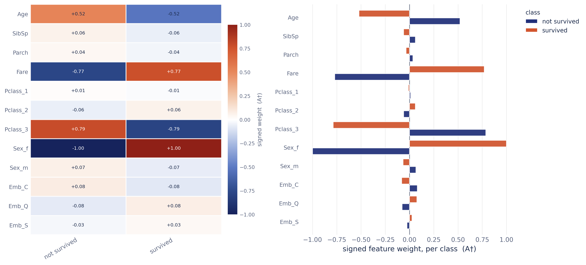
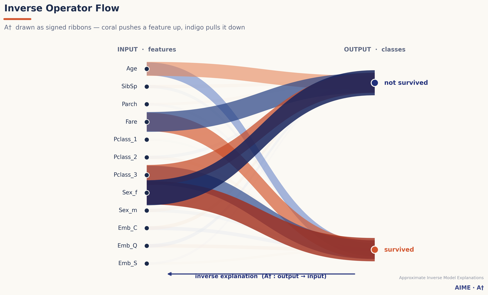
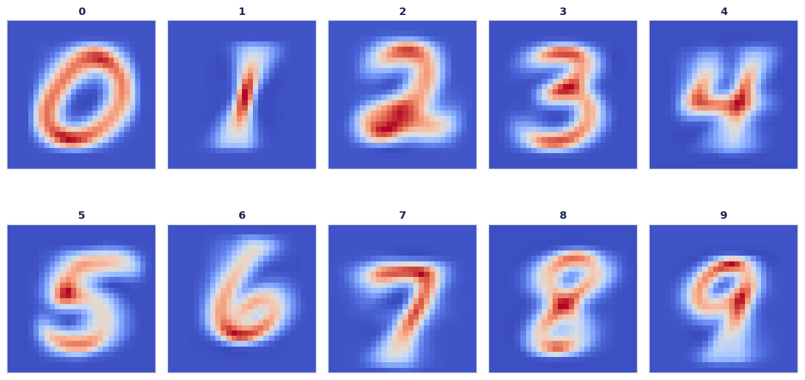
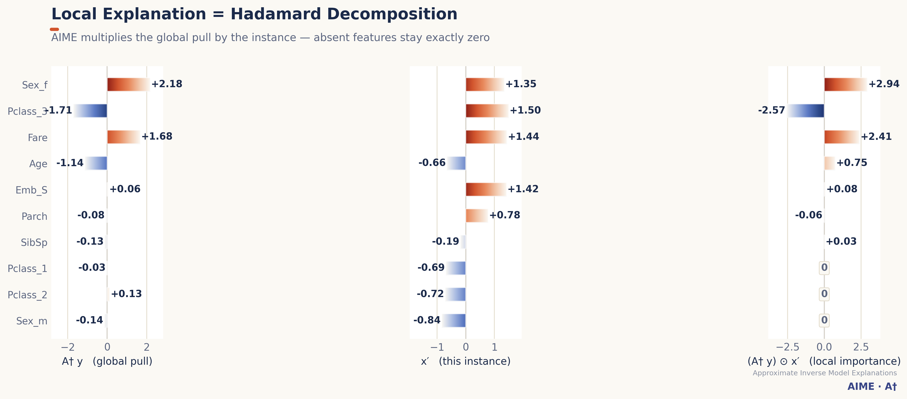
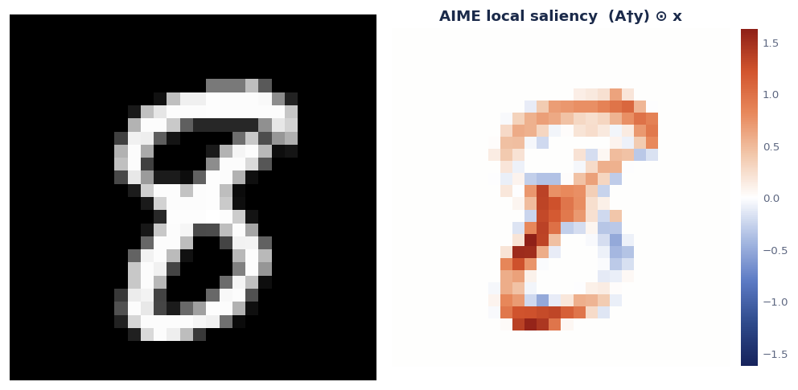
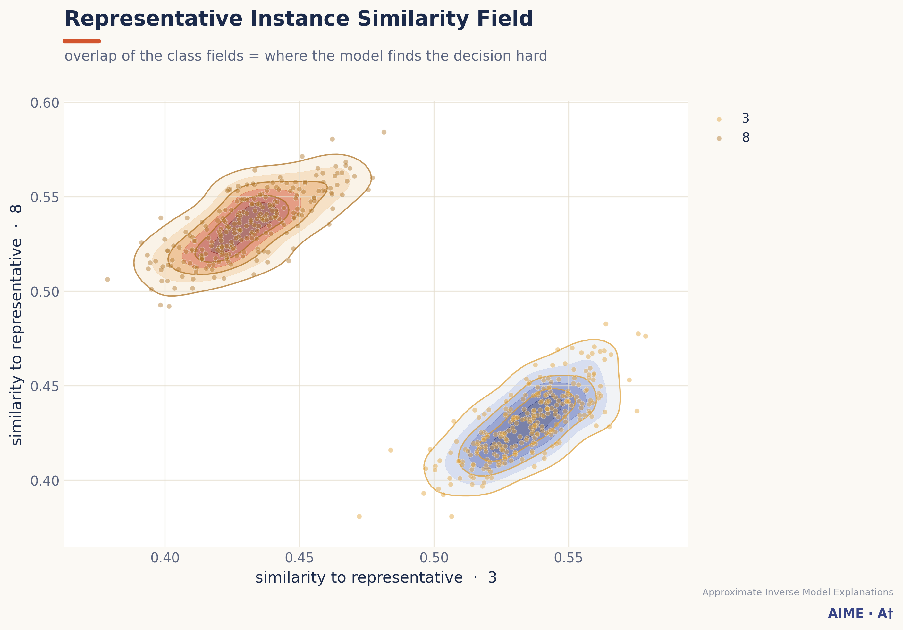
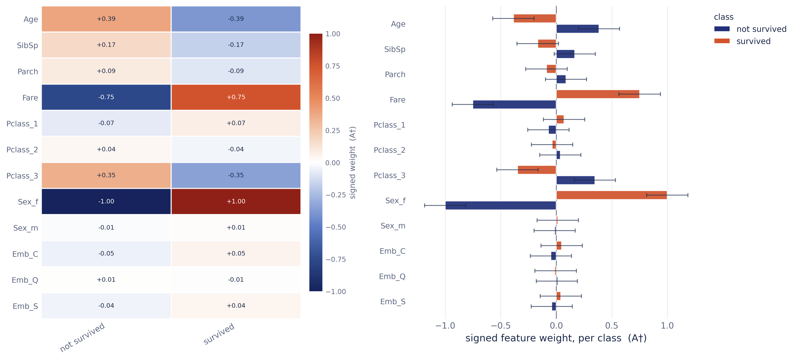
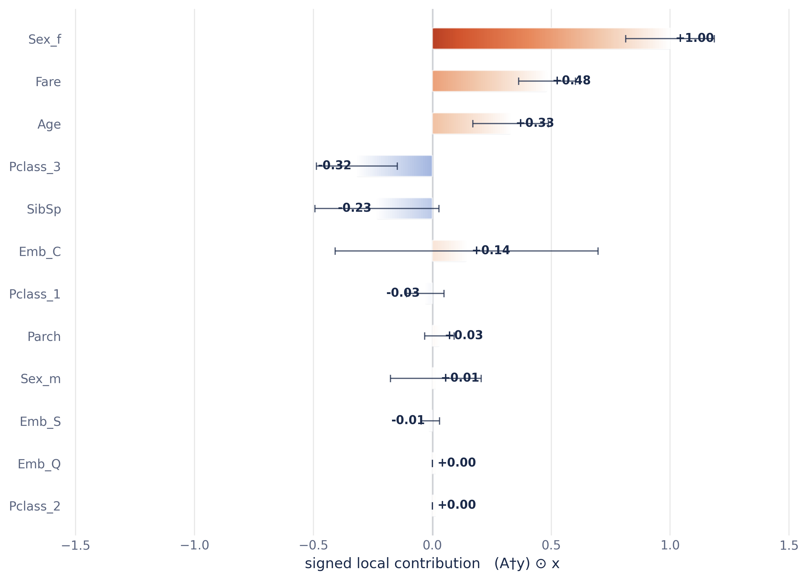
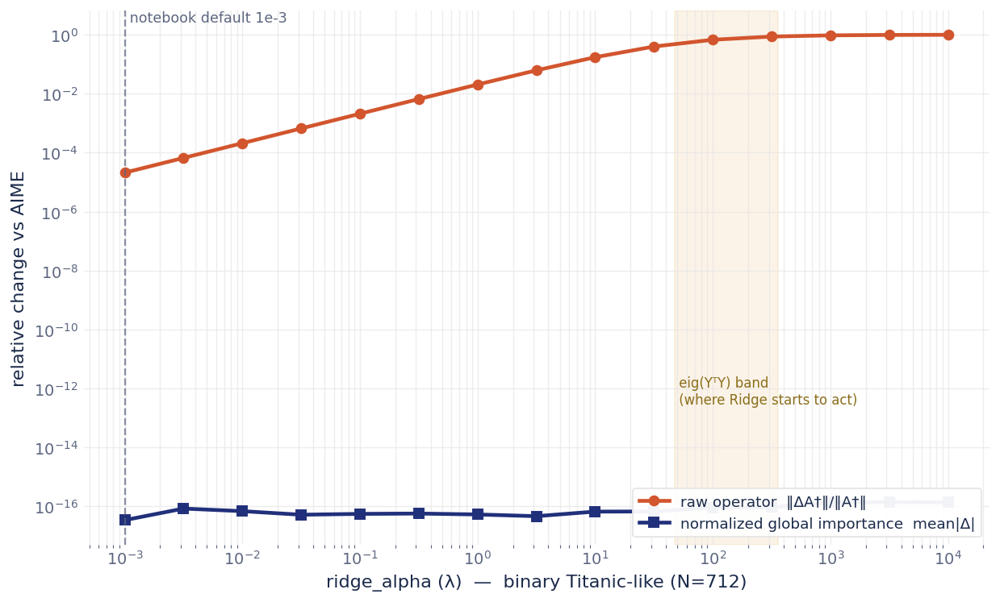

# AIME — Approximate Inverse Model Explanations · signature-visualisation edition
[](https://pypi.org/project/aime-xai/)[][](https://doi.org/10.5281/zenodo.17225491)
<p align="center">
  
</p>


`aime_xai` is a model-agnostic **explainable-AI**
library that explains a black-box model by building its **approximate inverse
operator** `A†`, then reading explanations *backwards* — from the model output
`y` to the input `x`. 
The AIME methodology is detailed in the paper available at The AIME methodology is detailed in the paper available at [https://ieeexplore.ieee.org/document/10247033](https://ieeexplore.ieee.org/document/10247033). 
From the single operator it derives **global** and
**local** feature importance, plus diagnostics no forward-problem method
(LIME/SHAP) can produce.

This edition keeps the canonical AIME mathematics **unchanged** and adds:

- **One class, five variants** — AIME, HuberAIME, RidgeAIME, Huber-RidgeAIME, BayesianAIME.
- A **signature, publication-grade visual layer** (white background, no chart-junk,
  an `A†` design language) that does not look like default matplotlib.
- **Inverse-operator-only** visualisations: operator-flow ribbons, representative
  "ideal input" reconstruction, Hadamard local decomposition, analytic saliency,
  a representative-similarity field, and **interactive** Colab explorers.
- **BayesianAIME credible intervals** drawn directly on the importance plots.

---

## The AIME family — one class, five variants

All five are the **same** `AIME` class selected by flags; **every variant works
with every visualisation**. The operator math is identical to the papers.

| Variant | Construction | How to call | Reference |
|---|---|---|---|
| **AIME** | Moore–Penrose pseudo-inverse `A† = X' Y⁺` | `AIME()` | Nakanishi 2023 |
| **HuberAIME** | Huber-loss IRLS (outlier-robust) | `AIME(use_huber=True)` | Nakanishi 2025 |
| **RidgeAIME** | ℓ2 closed form `X'Yᵀ(YYᵀ+λI)⁻¹` | `AIME(use_ridge=True)` | Itoh & Nakanishi 2025 |
| **Huber-RidgeAIME** | robust **and** regularised | `AIME(use_huber=True, use_ridge=True)` | — |
| **BayesianAIME** | posterior mean + covariance → **95% credible intervals** | `AIME(use_bayesian=True)` | Nakanishi 2025 |

`use_bayesian` cannot be combined with Huber/Ridge.

---

## Installation

```bash
pip install aime-xai
```

Dependencies: `numpy`, `pandas`, `scikit-learn`, `matplotlib` (the visualisation
layer itself needs only numpy + matplotlib).

---

## Quick start (Titanic)

AIME is model-agnostic — it consumes the model's `predict_proba`, never its
internals.

```python
import numpy as np
from aime_xai import AIME

# X_train: (N, d) inputs ;  y_hat_train = model.predict_proba(X_train): (N, m)
feature_names = column_features            # e.g. ['Age','SibSp',...,'Embarked_S']
class_names   = ['not survived', 'survived']

explainer = AIME().create_explainer(X_train, y_hat_train, normalize=True)
explainer.A_dagger.shape
```
```text
(12, 2)        # (n_features, n_classes) — the inverse operator A†
```

### Global feature importance — per class

```python
g = explainer.global_feature_importance(
        feature_names=feature_names, class_names=class_names)
g.round(2)        # returned DataFrame (class × feature)
```
```text
               Age  SibSp  Parch  Fare  Pclass_1  Pclass_2  ...
not survived -0.05   -0.0    0.0 -0.79      -0.0     -0.02
survived      0.05    0.0   -0.0  0.79       0.0      0.02
```



The left panel is the **operator field** (the signed `A†` matrix); the right
panel shows **per-class** signed weights with a class legend — AIME's signature
ability to give a *distinct importance vector for every output class*.

### Local feature importance — one instance

Local importance is the Hadamard product `(A† y) ⊙ x'`. Because it multiplies by
the instance, **features that are zero in `x` get exactly zero importance**.

```python
explainer.local_feature_importance(
    jack, [0, 1], feature_names=feature_names, scaler=explainer.scaler,
    ignore_zero_features=True, top_k=5).round(2)
```
```text
   Sex_female  Fare  Pclass_3  Embarked_Q  Embarked_S
0         1.0  0.82     -0.79        0.05        0.02
```

---

## Visualisation catalogue

### Unique to the inverse-operator view (no LIME/SHAP equivalent)

**Inverse Operator Flow** — `A†` itself, drawn as signed ribbons flowing
*output → input* (the inverse direction). Coral pushes a feature up, indigo pulls
it down; width = |weight|.

```python
explainer.plot_inverse_operator_flow(feature_names=feature_names, class_names=class_names)
```


**Representative estimation instances** — `A† eₜ`, the *ideal input* the model
reconstructs for each class. For image models it reconstructs an **ideal class
image**; for tabular data, a feature fingerprint.

```python
rep = explainer.representative_instance(scaler=explainer.scaler,
                                        feature_names=feature_names, class_names=class_names)
explainer.plot_representative_instance(scaler=explainer.scaler, image_shape=(28, 28))  # image models
```


**Local Hadamard decomposition** — shows a local explanation being built as
`global pull × instance`; absent features visibly collapse to exactly zero.

```python
explainer.plot_local_hadamard_decomposition(jack, np.array([0., 1.]),
                                             feature_names=feature_names, top_k=12)
```


**Local saliency (image models)** — analytic saliency `(A† y) ⊙ x` reshaped onto
the image grid. No gradients, no perturbations.

```python
explainer.plot_local_saliency(x, y, image_shape=(28, 28), scaler=explainer.scaler)
```


**Representative instance similarity field** — every point scored by RBF
similarity to two classes' representative instances; the overlap is where the
model finds the decision hard. Use `gamma='scale'` for high-dimensional inputs.

```python
explainer.plot_rep_instance_similarity(
    X_test, y_hat_test, feature_names=feature_names, class_names=class_names,
    gamma='scale', class_indices=[3, 8])
```


---

## BayesianAIME — uncertainty on the explanation

BayesianAIME estimates a posterior over `A†`, so the importance plots carry
**95% credible intervals** and the returned frames hold `mean / lower_bound /
upper_bound`.

```python
bayes = AIME(use_bayesian=True, bayesian_sigma=1.0, bayesian_tau=1.0)
bayes.create_explainer(X_train, y_hat_train, normalize=True)

bayes.local_feature_importance(jack, [0, 1], feature_names=feature_names, top_k=4).round(2)
```
```text
             Sex_female  Fare  Pclass_3  Embarked_Q
mean               1.00  0.82     -0.79        0.05
lower_bound        0.89  0.71     -0.90       -0.06
upper_bound        1.11  0.94     -0.67        0.16
```

| Global (per class) | Local (one instance) |
|---|---|
|  |  |

---

## Note on RidgeAIME effectiveness

Whether RidgeAIME visibly differs from AIME depends on the data:

1. **λ vs sample size.** Ridge's `λI` competes with `YᵀY`, whose eigenvalues
   scale with `N`. On Titanic (`N≈700`) they are `~10²–10³`, so the default
   `λ=1e-3` changes the *raw* operator by only `~1e-5`. Ridge becomes active once
   `λ` reaches that band.
2. **Binary + normalisation.** With two classes, Ridge rescales each class column
   of `A†` by an almost-constant factor, and the per-class peak normalisation in
   `global_feature_importance` divides it out — so even a large `λ` leaves the
   *normalised* importance essentially unchanged (for ≥3 classes the cancellation
   is only partial).

To judge Ridge, compare the **raw operator** `A_dagger` (or sweep `λ`):



*(raw-operator change rises with λ toward the `eig(YᵀY)` band; the normalised
global importance stays at machine-zero for binary tasks.)*


## Publication mode (default on)

Figures are publication-clean by default: **white background, no title/subtitle
headers, no brand mark** — only in-figure captions (axis labels, legends, value
labels, colorbars), so a figure drops straight into a paper. To restore the
titled/branded look (e.g. for slides):

```python
import aime_xai.style as S
S.set_publication_mode(False)
```

---

## Interactive explorers (render inline in Colab)

Both return a Colab/Jupyter object that displays inline when it is the last
expression in a cell; pass `path=...` to also save a standalone `.html`.

```python
explainer.interactive_operator_flow(feature_names=feature_names, class_names=class_names)

# set a target output y with sliders → reconstruct the input x = scaler⁻¹(A†·y) live.
# image models morph an ideal-image canvas; tabular shows a standardized z = A†·y profile.
explainer.interactive_reconstruction(image_shape=(28, 28), class_names=class_names,
                                     path='aime_reconstruction.html')
```

---

## Preserved API

All public class/method names and signatures match the canonical implementation,
so existing code keeps working; plotting methods only gain optional `save_path` /
`show` arguments.

`AIME(...)` · `create_explainer` · `global_feature_importance` ·
`global_feature_importance_each` · `global_feature_importance_without_viz` ·
`local_feature_importance` · `local_feature_importance_without_viz` ·
`representative_instance` · `plot_representative_instance` ·
`plot_inverse_operator_flow` · `plot_local_hadamard_decomposition` ·
`plot_local_saliency` · `rbf_kernel` · `plot_rep_instance_similarity` ·
`interactive_operator_flow` · `interactive_reconstruction` · `export_interactive`

---

## License

AIME is **dual-licensed** under the 2-Clause BSD License and a Commercial
License. Apply the 2-Clause BSD License only for academic or research purposes,
and the Commercial License for commercial and other purposes — you choose which
to use. For commercial licensing (a fee may apply), contact
**takafumi@eigenbeats.com**.

---

## Citation

If you use this software, please cite the relevant paper(s).

```bibtex
@ARTICLE{10247033,
  author={Nakanishi, Takafumi},
  journal={IEEE Access},
  title={Approximate Inverse Model Explanations (AIME): Unveiling Local and Global Insights in Machine Learning Models},
  year={2023}, volume={11}, pages={101020-101044},
  doi={10.1109/ACCESS.2023.3314336}}

@ARTICLE{10979913,
  author={Nakanishi, Takafumi},
  journal={IEEE Access},
  title={HuberAIME: A Robust Approach to Explainable AI in the Presence of Outliers},
  year={2025}, volume={13}, pages={76796-76810},
  doi={10.1109/ACCESS.2025.3565279}}

@INPROCEEDINGS{IIAI-AAI-Winter2025-RidgeAIME,
  author={Itoh, T. and Nakanishi, Takafumi},
  booktitle={2025 19th IIAI International Congress on Advanced Applied Informatics (IIAI-AAI-Winter)},
  title={Approximate Inverse Model Explanations for Metamaterial Design with Scalar-Field-Based Metal Foam Surrogates},
  year={2025}, pages={179-184}, address={Phuket, Thailand},
  doi={10.1109/IIAI-AAI-Winter69777.2025.00041}}

@ARTICLE{BayesianAIME2025,
  author={Nakanishi, Takafumi},
  journal={IEEE Access},
  title={Bayesian-AIME: Quantifying Uncertainty and Enhancing Stability in Approximate Inverse Model Explanations},
  year={2025},
  doi={10.1109/ACCESS.2025.3617984}}

@ARTICLE{10648696,
  author={Nakanishi, Takafumi},
  journal={IEEE Access},
  title={PCAIME: Principal Component Analysis-Enhanced Approximate Inverse Model Explanations Through Dimensional Decomposition and Expansion},
  year={2024}, volume={12}, pages={121093-121113},
  doi={10.1109/ACCESS.2024.3450299}}
```

Author: **Takafumi Nakanishi** · takafumi@eigenbeats.com
