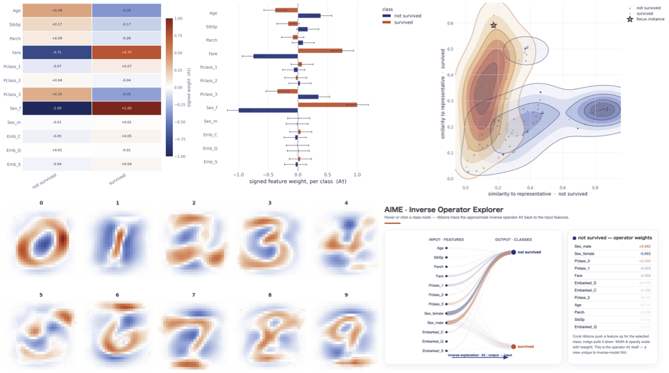
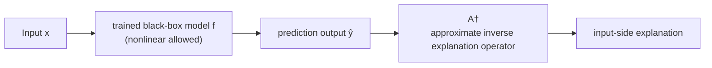
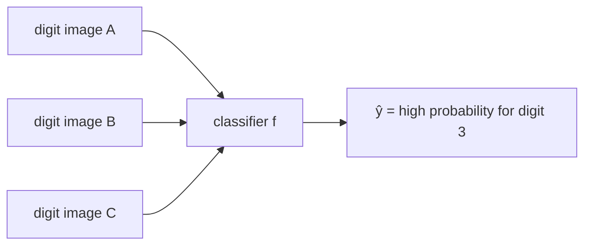
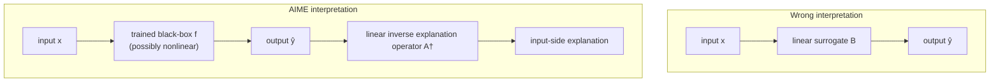

# Why AIME?

[← Back to the main README](../README.md)

<p align="center">
  
</p>

> **AIME treats model explanation as an approximate inverse problem.**  
> It learns a map from model outputs back to input-side feature patterns, then derives global, local, representative, and uncertainty-aware explanations from that single operator.

## The idea in 30 seconds

Let:

- `X ∈ R^(N×d)` be the input data,
- `Y ∈ R^(N×m)` be the corresponding model outputs, such as class probabilities,
- `X_s` be the optionally standardized input data.

AIME estimates an approximate inverse explanation operator:

```text
A† = X_sᵀ (Yᵀ)⁺    with A† ∈ R^(d×m)
```

where `⁺` denotes the Moore–Penrose pseudoinverse. For an output vector `y`, the operator maps back toward an input-side pattern:

```text
x_s ≈ A† y
```

`A†` is not assumed to be an exact inverse of a nonlinear black-box model. It is a **data-dependent linear approximation** over the input representation, output representation, and samples supplied to AIME.

```text
input samples X ──► black-box model ──► model outputs Y
       │                                      │
       └──────── learn one operator A† ◄──────┘

new output y ──► A†y ──► input-side explanation
```

## One operator, several explanation views

The central benefit of AIME is that its explanation views are connected by the same operator rather than being produced by unrelated procedures.

| Question | AIME quantity | Interpretation |
|---|---|---|
| Which features characterize output or class `t`? | `A† e_t` | A signed, per-output global feature-weight vector. |
| What input pattern is associated with output or class `t`? | `A† e_t`, transformed back to the original feature scale | A representative estimation instance: a tabular feature fingerprint or an image-like class pattern. |
| Why does this instance receive output `y`? | `(A† y) ⊙ x_s` | Local feature importance for the instance, combining the output-side pull with the observed input values. |
| How does the dataset relate to representative outputs? | Similarity between samples and representative estimation instances | A representative-instance similarity field that exposes overlap, separation, and ambiguous regions. |
| How stable are the estimated weights? | A distribution over `A†` in BayesianAIME | Interval estimates for global and local explanations. |

Here, `e_t` is the basis vector for output dimension `t`, and `⊙` is the element-wise product.

## Why use the inverse-operator view?

### A coherent global-to-local explanation

AIME derives its global and local views from the same fitted object. A global class signature, a representative pattern, and an instance-level explanation therefore share one mathematical reference point.

### A distinct explanation for every output dimension

Each column of `A†` describes how one output coordinate maps back to the input-feature space. This is useful for multiclass problems because each class receives its own signed feature pattern rather than only a single overall ranking.

### Representative input-side patterns

AIME can map a pure output basis vector back into the feature space. For tabular data, this gives a class-associated feature fingerprint. For image-shaped features, it can be reshaped into a representative class pattern.

### Model-agnostic and gradient-free

AIME requires paired inputs and model outputs, not access to model parameters, gradients, or internal layers. Once the output matrix has been collected, the standard operator is computed directly rather than fitting a new local surrogate for every explained instance.

### An inspectable mathematical object

The fitted `A†` matrix can be examined directly, visualized as an operator flow, compared across datasets or model versions, and regularized or robustified when the data require it.

## AIME, LIME, and SHAP answer different questions

AIME is best viewed as a complementary explanation framework, not as a universal replacement for every attribution method.

| Dimension | AIME | LIME | SHAP |
|---|---|---|---|
| Primary starting point | A dataset of inputs and corresponding model outputs | A prediction and a local neighborhood around that instance | A prediction together with a background or reference distribution |
| Primary explanation object | One approximate inverse operator `A†` | A locally fitted interpretable surrogate | Additive feature attributions based on Shapley values |
| Global view | Direct per-output columns of `A†` | Usually assembled from selected or aggregated local explanations | Commonly assembled by aggregating local SHAP values |
| Local view | `(A† y) ⊙ x_s` | Coefficients of the local surrogate | Per-feature additive attribution values |
| Representative input pattern | Directly available from `A† e_t` | Not the primary output | Not the primary output |
| Additional model evaluations | Uses outputs collected for the chosen dataset | Usually evaluates perturbed samples for each local explanation | Depends on the SHAP explainer; model-agnostic variants may require many evaluations |

Use LIME when a sparse local surrogate around one prediction is the desired explanation. Use SHAP when Shapley-based additive attribution and its associated axioms are central. Use AIME when a **single output-to-input operator**, consistent global/local views, and representative input-side patterns are the main goals.

## When AIME is a good fit

AIME is especially useful when:

- the model exposes vector outputs such as probabilities, scores, or multiple response dimensions;
- you want class-wise or output-wise global explanations;
- you want global, local, and representative explanations in one framework;
- you want to compare the inverse operators of different models, datasets, or training runs;
- gradients are unavailable or inappropriate;
- representative feature patterns or similarity fields are useful for understanding the dataset;
- robustness, regularization, or explanation uncertainty is important.

## Choose an AIME variant

All variants in this repository use the same `AIME` class and the same visualization API.

| Variant | Use it when… | Call |
|---|---|---|
| **AIME** | You want the canonical Moore–Penrose pseudoinverse formulation. | `AIME()` |
| **HuberAIME** | Outliers may dominate the inverse operator. | `AIME(use_huber=True)` |
| **RidgeAIME** | The output-side system is ill-conditioned or regularization is needed. | `AIME(use_ridge=True)` |
| **Huber-RidgeAIME** | You need both outlier robustness and regularization. | `AIME(use_huber=True, use_ridge=True)` |
| **BayesianAIME** | You want interval estimates for operator entries and feature importance. | `AIME(use_bayesian=True)` |

The effect of Ridge regularization depends on the scale and spectrum of `YᵀY`; inspect the raw operator and tune `ridge_alpha` rather than assuming that a small default value will visibly change normalized importance plots.

## Interpret AIME responsibly

AIME explanations are conditioned on the data and representations used to build the operator. In practice:

- changing the reference dataset can change `A†`;
- feature scaling, encoding, and output calibration affect the interpretation;
- correlated features can share or redistribute signed weights;
- representative estimation instances are operator-derived patterns, not necessarily observed people or records;
- local and global importance describe associations in the fitted inverse explanation, not causal effects;
- Bayesian intervals depend on the probabilistic assumptions and should not replace external stability checks;
- high-stakes applications should compare explanations across resamples, model versions, and domain-relevant validation sets.

A useful workflow is to report the dataset, preprocessing, model-output definition, AIME variant, and principal hyperparameters together with every explanation.

## Start with a notebook

| Notebook | Purpose | Run |
|---|---|---|
| [Titanic quick start](../examples/colab/01_titanic_quickstart.ipynb) | Build AIME and inspect global, local, representative, and inverse-operator explanations. | [](https://colab.research.google.com/github/ntakafumi/aime/blob/main/examples/colab/01_titanic_quickstart.ipynb) |
| [AIME vs SHAP/LIME](../examples/colab/02_aime_vs_shap_lime.ipynb) | Compare the explanation objects and the questions answered by each method. | [](https://colab.research.google.com/github/ntakafumi/aime/blob/main/examples/colab/02_aime_vs_shap_lime.ipynb) |
| [BayesianAIME uncertainty](../examples/colab/03_bayesian_aime_uncertainty.ipynb) | Explore interval estimates for global and local explanations. | [](https://colab.research.google.com/github/ntakafumi/aime/blob/main/examples/colab/03_bayesian_aime_uncertainty.ipynb) |

# Why Can a Linear Inverse Operator Explain Nonlinear Models?

**A mathematical guide to AIME (Approximate Inverse Model Explanations)**

This document explains one of the most important points about AIME:

> AIME uses a linear inverse explanation operator, but it does **not** assume that the prediction model is linear.

The core idea is simple but often misunderstood:

> **The prediction model and the explanation model are different mathematical objects.**

AIME does not replace a nonlinear black-box predictor with a linear predictor.  
Instead, after a trained model has produced its outputs, AIME learns a linear operator that maps those outputs back to input-side explanatory patterns.

In one sentence:

> **AIME is a linear decoder from the model-output space to the input space; the encoder may be arbitrarily nonlinear.**

---

## Table of contents

1. [The common misconception](#1-the-common-misconception)
2. [Prediction models and explanation models](#2-prediction-models-and-explanation-models)
3. [The mathematical setup](#3-the-mathematical-setup)
4. [Why the true inverse usually does not exist](#4-why-the-true-inverse-usually-does-not-exist)
5. [The approximate inverse explanation problem](#5-the-approximate-inverse-explanation-problem)
6. [What is actually being approximated?](#6-what-is-actually-being-approximated)
7. [The key reason nonlinear models are allowed](#7-the-key-reason-nonlinear-models-are-allowed)
8. [Operator-theoretic viewpoint](#8-operator-theoretic-viewpoint)
9. [Best linear inverse explanation](#9-best-linear-inverse-explanation)
10. [A simple example](#10-a-simple-example)
11. [Why the operator is interpretable](#11-why-the-operator-is-interpretable)
12. [Global, local, and representative explanations](#12-global-local-and-representative-explanations)
13. [Relationship to SHAP and LIME](#13-relationship-to-shap-and-lime)
14. [Why AIME is not “just linear regression”](#14-why-aime-is-not-just-linear-regression)
15. [Extensions: Ridge, Huber, and Bayesian AIME](#15-extensions-ridge-huber-and-bayesian-aime)
16. [When the linear inverse explanation is reliable](#16-when-the-linear-inverse-explanation-is-reliable)
17. [Limitations and careful interpretation](#17-limitations-and-careful-interpretation)
18. [Frequently asked questions](#18-frequently-asked-questions)
19. [Short explanation for README or talks](#19-short-explanation-for-readme-or-talks)
20. [References](#20-references)

---

# 1. The common misconception

AIME is sometimes misunderstood as a method that can only explain linear models.

The misunderstanding usually comes from the symbol

$$
A^\dagger.
$$

Because \(A^\dagger\) is a linear operator, one may think:

> "If the explanation operator is linear, then the original prediction model must also be linear."

This conclusion is false.

AIME does **not** assume

$$
f(x) \approx Ax.
$$

AIME does **not** approximate the forward prediction model by a linear model.

Instead, AIME constructs an approximate inverse explanation operator after the model has already produced its outputs.

The correct distinction is:

| Object | Direction | May be nonlinear? | Role |
|---|---:|---:|---|
| Prediction model \(f\) | input \(\rightarrow\) output | Yes | Produces predictions |
| AIME explanation operator \(A^\dagger\) | output \(\rightarrow\) input-side explanation | Linear by design | Explains outputs in input coordinates |

Thus, the linearity of \(A^\dagger\) is not a restriction on the model \(f\).

It is a design choice for the explanation model.

---

# 2. Prediction models and explanation models

Let a trained black-box model be

$$
f:\mathbb{R}^{d}\rightarrow\mathbb{R}^{c},
$$

where

- \(d\) is the number of input features,
- \(c\) is the number of output components, such as classes, scores, logits, or probabilities.

The prediction model may be any trained model:

- Random Forest
- Gradient boosting
- XGBoost
- LightGBM
- Support Vector Machine
- Neural network
- CNN
- Transformer
- Any other black-box predictor that produces output scores

AIME does not inspect the model internals.

It only needs the predictions:

$$
\hat y = f(x).
$$

The model \(f\) can be highly nonlinear.  
It may have decision trees, kernels, neural activations, attention blocks, or any other nonlinear mechanism.

AIME starts **after** this nonlinear prediction step.



The prediction model answers:

> What output does the model assign to this input?

The explanation model answers:

> What input-side pattern is associated with this output?

These are different questions.

---

# 3. The mathematical setup

We use a column-vector convention in the derivation.

Let

$$
x_i\in\mathbb{R}^{d}
$$

be the \(i\)-th input sample, and let

$$
\hat y_i=f(x_i)\in\mathbb{R}^{c}
$$

be the output of the trained model.

Collect the samples as matrices:

$$
X = [x_1,\ldots,x_n]\in\mathbb{R}^{d\times n},
$$

$$
\hat Y = [\hat y_1,\ldots,\hat y_n]\in\mathbb{R}^{c\times n}.
$$

AIME seeks an operator

$$
A^\dagger\in\mathbb{R}^{d\times c}
$$

such that

$$
X\approx A^\dagger \hat Y.
$$

In words:

> AIME reconstructs input-side patterns from model outputs.

This orientation is essential.

AIME does **not** seek a matrix \(B\) such that

$$
\hat Y\approx BX.
$$

That would be a forward surrogate model.

AIME seeks the reverse direction:

$$
X\approx A^\dagger \hat Y.
$$

---

# 4. Why the true inverse usually does not exist

A natural first idea is to compute the inverse of the prediction model:

$$
x = f^{-1}(\hat y).
$$

In real machine-learning models, this inverse usually does not exist.

There are several reasons.

## 4.1 Many-to-one mappings

Many different inputs can lead to the same prediction output.

For example, in an image classifier, many different images of the same digit may produce almost the same probability vector.



If multiple inputs correspond to one output, the inverse is not a function.

Mathematically:

$$
x_1\neq x_2
\quad\text{but}\quad
f(x_1)=f(x_2).
$$

Then

$$
f^{-1}(f(x_1))
$$

cannot choose a unique input.

## 4.2 Dimensionality reduction

Often

$$
d \gg c.
$$

For example, an image may have hundreds or thousands of input dimensions, while the output may have only 10 classes.

A map from a high-dimensional space to a low-dimensional space generally loses information.

A unique inverse cannot be expected.

## 4.3 Probability outputs are constrained

For classification probabilities,

$$
\hat y_k\ge 0,\qquad
\sum_{k=1}^{c}\hat y_k=1.
$$

Thus, the output lies on a probability simplex of effective dimension \(c-1\).

This makes the inverse even more underdetermined.

## 4.4 Nonlinear decision boundaries

Modern models often create nonlinear partitions of the input space.

The same output score may correspond to disconnected regions in the input space.

Thus, even a set-valued inverse may be complex.

---

# 5. The approximate inverse explanation problem

Since the true inverse is usually unavailable, AIME asks a different question:

> Among simple and interpretable inverse maps, which one best reconstructs the observed inputs from the model outputs?

The simplest and most interpretable class is the class of linear operators from output space to input space.

AIME solves

$$
\boxed{
A^\dagger
=
\arg\min_A
\|X-A\hat Y\|_F^2.
}
$$

Here

$$
\|M\|_F^2
=
\sum_{i,j}M_{ij}^2
$$

is the squared Frobenius norm.

Equivalently,

$$
A^\dagger
=
\arg\min_A
\sum_{i=1}^{n}
\|x_i-A\hat y_i\|_2^2.
$$

Thus, \(A^\dagger\) is the operator that best reconstructs the input samples from the prediction outputs in the least-squares sense.

If \(\hat Y\hat Y^T\) is invertible, the normal equations give

$$
A^\dagger
=
X\hat Y^T(\hat Y\hat Y^T)^{-1}.
$$

In general, using the Moore–Penrose pseudoinverse,

$$
\boxed{
A^\dagger=X\hat Y^{+}.
}
$$

This is the mathematical core of AIME.

---

# 6. What is actually being approximated?

This is the most important section.

AIME does **not** approximate

$$
f(x)
$$

by a linear function.

AIME does **not** solve

$$
f(x)\approx Bx.
$$

AIME solves

$$
X\approx A^\dagger \hat Y.
$$

That is,

$$
x_i\approx A^\dagger f(x_i).
$$

Therefore, the approximation is applied in the output-to-input direction.

The model \(f\) remains exactly the model the user trained.



The wrong interpretation says:

> AIME assumes \(f\) is linear.

The correct interpretation says:

> AIME uses the model outputs as explanatory coordinates and learns a linear inverse decoder from those coordinates to input-side patterns.

These are not the same.

---

# 7. The key reason nonlinear models are allowed

There is an even deeper reason why AIME can explain nonlinear models.

The operator \(A^\dagger\) is linear in the output variable \(\hat y\), not necessarily linear in the original input \(x\).

For an input \(x\), the AIME reconstruction is

$$
\hat x_{\mathrm{AIME}}
=
A^\dagger \hat y
=
A^\dagger f(x).
$$

If \(f\) is nonlinear, then the composition

$$
A^\dagger\circ f
$$

is generally nonlinear as a function of \(x\).

That is,

$$
x
\mapsto
A^\dagger f(x)
$$

can be nonlinear even though \(A^\dagger\) is linear in \(\hat y\).

This point is crucial.

AIME is linear in the **model-output coordinates**.

But those output coordinates are themselves nonlinear functions of the input whenever the trained model is nonlinear.

This is similar to the common idea of using a linear readout on nonlinear features.

For example, a neural network may learn nonlinear features \(h(x)\), and the final classifier may be linear in \(h(x)\).  
The final linear layer does not imply that the whole neural network is linear.

Likewise, AIME may be linear in \(\hat y=f(x)\), while \(f(x)\) may encode nonlinear information about \(x\).

So the correct statement is:

> AIME is a linear operator on the model-output representation, not a linear model on the original input.

This is why AIME can be applied to nonlinear prediction models.

---

# 8. Operator-theoretic viewpoint

AIME can also be understood as an operator approximation problem.

Let \(X\) and \(Y\) be random vectors:

$$
X:\Omega\rightarrow\mathbb{R}^{d},
$$

$$
Y=f(X):\Omega\rightarrow\mathbb{R}^{c}.
$$

Assume they have finite second moments:

$$
\mathbb{E}\|X\|^2<\infty,
\qquad
\mathbb{E}\|Y\|^2<\infty.
$$

Consider the Hilbert space \(L^2\) of square-integrable random vectors with inner product

$$
\langle U,V\rangle
=
\mathbb{E}[U^T V].
$$

AIME searches within the finite-dimensional class

$$
\mathcal{H}_Y
=
\{AY: A\in\mathbb{R}^{d\times c}\}.
$$

This is the space of all linear reconstructions of \(X\) from \(Y\).

The population AIME operator is

$$
A_*=
\arg\min_A
\mathbb{E}
\left[
\|X-AY\|^2
\right].
$$

The normal equation is

$$
\mathbb{E}[(X-A_*Y)Y^T]=0.
$$

Equivalently,

$$
\mathbb{E}[XY^T]
=
A_*\mathbb{E}[YY^T].
$$

If \(\mathbb{E}[YY^T]\) is invertible,

$$
A_*
=
\mathbb{E}[XY^T]
\left(\mathbb{E}[YY^T]\right)^{-1}.
$$

If not, one uses the pseudoinverse.

This is the population version of the AIME estimator.

The sample version replaces expectations with empirical averages and gives the matrix formula in the previous section.

## Projection interpretation

The residual

$$
R=X-A_*Y
$$

is orthogonal to every linear reconstruction from \(Y\):

$$
\mathbb{E}[R Y^T]=0.
$$

Thus \(A_*Y\) is the orthogonal projection of \(X\) onto the subspace of linear functions of \(Y\).

This gives a precise meaning to the phrase:

> AIME is the best linear inverse explanation of the input in the output-coordinate space.

Again, no linearity of \(f\) is required.

The random vector \(Y=f(X)\) may be generated by any nonlinear function.

---

# 9. Best linear inverse explanation

The phrase "best linear approximation" should be interpreted carefully.

AIME does not claim that the true inverse is linear.

Instead, it defines a specific explanation object:

$$
A^\dagger
=
\text{the best linear inverse reconstruction operator from model outputs to inputs}.
$$

This is analogous to several standard mathematical practices.

## 9.1 PCA analogy

PCA uses linear subspaces to summarize data.

This does not imply that the data distribution itself is linear.

PCA asks:

> Which linear subspace preserves as much variance as possible?

AIME asks:

> Which linear inverse operator reconstructs input-side patterns from model outputs as well as possible?

In both cases, the linear object is a structured summary.

It is not a claim that the entire phenomenon is linear.

## 9.2 Linear decoder analogy

In representation learning, it is common to learn a nonlinear encoder and a linear decoder.

For example:

$$
x
\rightarrow
h(x)
\rightarrow
\hat x.
$$

Even if the decoder is linear in \(h(x)\), the entire map from \(x\) to \(\hat x\) can be nonlinear because \(h(x)\) is nonlinear.

AIME has the same structure:

$$
x
\rightarrow
f(x)
\rightarrow
A^\dagger f(x).
$$

The prediction model \(f\) acts as a nonlinear encoder into output coordinates.

AIME acts as a linear decoder from those coordinates back to input-side explanation patterns.

## 9.3 Statistical projection analogy

In regression theory, the best linear predictor of \(X\) from \(Y\) is useful even when the relationship between \(X\) and \(Y\) is nonlinear.

The best linear predictor is not the true conditional expectation

$$
\mathbb{E}[X\mid Y],
$$

unless the relationship has special structure.

But it is still the optimal element in a clearly defined linear class.

Similarly, AIME does not claim that

$$
A^\dagger Y = \mathbb{E}[X\mid Y]
$$

in general.

It claims that \(A^\dagger Y\) is the best linear reconstruction of \(X\) from \(Y\) under the chosen loss.

This is a mathematically precise explanation object.

---

# 10. A simple example

Consider a one-dimensional nonlinear prediction model:

$$
f(x)=x^2.
$$

This function is nonlinear and not one-to-one because

$$
f(1)=f(-1)=1.
$$

A true inverse cannot distinguish \(1\) from \(-1\) using only \(y=x^2\).

Now suppose we observe samples \(x_i\) and outputs

$$
y_i=f(x_i)=x_i^2.
$$

AIME seeks a scalar \(a\) minimizing

$$
\sum_i (x_i-a y_i)^2.
$$

This gives the best linear reconstruction of \(x\) from the nonlinear output \(y=x^2\).

If the dataset is symmetric around zero, this optimal \(a\) may be close to zero because \(y\) contains magnitude information but not sign information.

This is not a failure of AIME.

It is a diagnostic fact:

> The model output \(y=x^2\) does not contain enough information to recover the sign of \(x\).

Thus the residual is meaningful.

It tells us that the prediction output has discarded information needed to reconstruct certain input directions.

Now consider a less degenerate nonlinear model:

$$
f(x)=\sigma(3x),
$$

where \(\sigma\) is a sigmoid.

The model is nonlinear, but its output is monotone in \(x\).

A linear reconstruction from \(y=f(x)\) back to \(x\) can be a useful best linear inverse explanation over the observed range.

Again, AIME is not saying that the sigmoid is linear.

It is saying that within the observed output range, a linear inverse operator provides a structured and interpretable reconstruction of input-side variation.

---

# 11. Why the operator is interpretable

The matrix

$$
A^\dagger\in\mathbb{R}^{d\times c}
$$

has a simple interpretation.

Each column corresponds to one output component.

If \(e_k\) is the \(k\)-th standard basis vector in output space, then

$$
A^\dagger e_k
$$

is the input-side pattern associated with output component \(k\).

For a classification model with probability outputs,

$$
\hat y
=
\begin{bmatrix}
\hat y_1\\
\vdots\\
\hat y_c
\end{bmatrix},
\qquad
\sum_k \hat y_k=1,
$$

the reconstruction is

$$
A^\dagger \hat y
=
\sum_{k=1}^{c}
\hat y_k
A^\dagger e_k.
$$

Thus AIME expresses an input-side explanation as a weighted combination of class-wise input patterns.

This is why a linear operator is not an arbitrary simplification.

It gives a decomposable explanation:

- each output component contributes a column pattern;
- each prediction mixes those patterns according to the model output;
- local explanations arise from the same global operator.

For example, in a digit classifier,

$$
A^\dagger e_0
$$

may represent the input-side pattern associated with digit 0,

$$
A^\dagger e_1
$$

the pattern associated with digit 1,

and so on.

For a tabular model, each column tells how input features are associated with a particular output class or score.

---

# 12. Global, local, and representative explanations

A major strength of AIME is that several explanation objects come from the same operator.

The operator is not merely a coefficient matrix.

It is a common source for global, local, and representative explanations.

## 12.1 Global feature importance

The entry

$$
A^\dagger_{jk}
$$

connects input feature \(j\) to output component \(k\) in the inverse explanation.

Its sign and magnitude can be interpreted as a signed class-wise inverse association, depending on preprocessing and scaling.

A simple class-wise global importance measure is

$$
G_{jk}=|A^\dagger_{jk}|.
$$

One may also aggregate over output components:

$$
G_j
=
\sum_{k=1}^{c}
|A^\dagger_{jk}|.
$$

This gives a global input-feature importance derived directly from the inverse explanation operator.

## 12.2 Local feature importance

For a particular instance \(i\), the output is \(\hat y_i\).

The AIME reconstruction is

$$
\hat x_i
=
A^\dagger \hat y_i.
$$

Expanding componentwise:

$$
\hat x_{j i}
=
\sum_{k=1}^{c}
A^\dagger_{jk}\hat y_{k i}.
$$

Thus the contribution of output component \(k\) to input feature \(j\) for instance \(i\) is

$$
C^{(i)}_{jk}
=
A^\dagger_{jk}\hat y_{k i}.
$$

This gives a local decomposition:

$$
\hat x_i
=
\sum_{k=1}^{c}
\hat y_{k i}
A^\dagger e_k.
$$

In matrix form, one may view the local contribution matrix as

$$
C^{(i)}
=
A^\dagger
\operatorname{diag}(\hat y_i).
$$

The local explanation is therefore not an unrelated calculation.

It is a direct instance-specific activation of the global inverse operator.

## 12.3 Representative input patterns

The representative pattern for output component \(k\) is

$$
r_k
=
A^\dagger e_k.
$$

This is simply the \(k\)-th column of the inverse operator.

It answers:

> What input-side pattern is associated with a pure activation of output component \(k\)?

For probability outputs, a prediction vector is a mixture of such representative patterns:

$$
A^\dagger\hat y_i
=
\sum_k
\hat y_{k i}r_k.
$$

This gives an intuitive explanation of multiclass models.

## 12.4 Operator visualization

Because \(A^\dagger\) is a matrix, it can be visualized directly.

Possible visualizations include:

- heatmaps of \(A^\dagger\),
- signed class-wise feature weights,
- flow diagrams from output components to input features,
- representative images for image classifiers,
- local Hadamard decompositions,
- uncertainty bands in BayesianAIME.

These visualizations are possible because the explanation object is an operator.

AIME does not produce only a list of feature attributions.

It produces a structured map from output space to input space.

---

# 13. Relationship to SHAP and LIME

AIME should not be described as simply "better than SHAP" or "better than LIME."

A more accurate statement is:

> SHAP and LIME explain the forward relationship from input features to model outputs.  
> AIME explains the inverse relationship from model outputs back to input-side structures.

The mathematical objects are different.

## 13.1 SHAP

SHAP explains predictions using additive feature attributions.

A simplified form is

$$
g(z')
=
\phi_0+\sum_{j=1}^{d}\phi_j z'_j,
$$

where the \(\phi_j\) values represent feature contributions.

The central direction is still input-to-output:

$$
x
\rightarrow
f(x).
$$

SHAP assigns contribution values to features for a prediction.

## 13.2 LIME

LIME builds a local interpretable surrogate model around a particular input.

A typical local objective is

$$
\arg\min_g
\mathcal{L}(f,g,\pi_x)+\Omega(g),
$$

where \(g\) is an interpretable model and \(\pi_x\) weights samples by locality around \(x\).

Again, the direction is forward:

$$
x
\rightarrow
f(x).
$$

The surrogate model approximates the behavior of the predictor near a given input.

## 13.3 AIME

AIME instead solves

$$
X\approx A^\dagger\hat Y.
$$

The direction is inverse:

$$
\hat y
\rightarrow
x.
$$

This produces a different type of explanation object.

| Property | SHAP | LIME | AIME |
|---|---|---|---|
| Main direction | Input \(\rightarrow\) Output | Input \(\rightarrow\) Output | Output \(\rightarrow\) Input |
| Explanation object | Additive feature attribution | Local surrogate model | Inverse explanation operator |
| Scope | Often local, can be summarized globally | Local | Global operator with local decompositions |
| Uses a simple explanation model? | Yes | Yes | Yes |
| Requires the prediction model to be linear? | No | No | No |
| Produces representative input patterns directly? | Not as its primary object | Not as its primary object | Yes |
| Operator-level visualization | Not primary | Not primary | Primary |

The important point is that all three methods use simplified explanation structures.

The use of a linear or additive explanation object does not imply that the prediction model is linear.

This is widely accepted for SHAP and LIME.

The same logic applies to AIME.

The difference is the direction of explanation.

---

# 14. Why AIME is not “just linear regression”

Mathematically, the core estimator resembles multivariate least-squares regression from outputs to inputs.

But AIME is not merely ordinary regression used without interpretation.

The key differences are conceptual and structural.

## 14.1 The regressors are model outputs

AIME regresses input-side patterns on the model outputs.

The predictors in this regression are not raw variables selected arbitrarily.

They are the semantic output coordinates of a trained model.

For a classifier, these coordinates correspond to class scores or probabilities.

Thus the columns of \(A^\dagger\) are not generic regression coefficients.

They are class-wise or output-wise inverse explanation patterns.

## 14.2 The direction is intentionally inverted

Ordinary surrogate modeling often tries to approximate

$$
\hat Y\approx BX.
$$

AIME intentionally approximates

$$
X\approx A^\dagger\hat Y.
$$

This inversion changes the interpretation completely.

AIME is not trying to predict the model output.

The model has already done that.

AIME is trying to understand what input-side structure is encoded by those outputs.

## 14.3 One operator generates multiple explanation types

A usual regression coefficient matrix may be used for prediction.

In AIME, the same operator generates:

- global feature importance,
- local decompositions,
- representative input patterns,
- visual flow maps,
- uncertainty intervals in Bayesian variants.

This unification is part of the methodology.

## 14.4 The residual is an explanation diagnostic

The reconstruction residual

$$
R=X-A^\dagger\hat Y
$$

is also informative.

If the residual is small, the model outputs contain enough information to reconstruct major input-side patterns.

If the residual is large, the output representation may not contain enough information to recover some input directions.

This is not merely an error term.

It is a diagnostic of how much input-side structure is retained in the prediction outputs.

---

# 15. Extensions: Ridge, Huber, and Bayesian AIME

The basic least-squares AIME operator is only the starting point.

Several variants modify the objective while preserving the inverse-explanation viewpoint.

## 15.1 RidgeAIME

When \(\hat Y\hat Y^T\) is ill-conditioned or when outputs are highly correlated, ridge regularization stabilizes the operator.

The objective is

$$
A_\lambda^\dagger
=
\arg\min_A
\|X-A\hat Y\|_F^2
+
\lambda\|A\|_F^2.
$$

The solution is

$$
A_\lambda^\dagger
=
X\hat Y^T
(\hat Y\hat Y^T+\lambda I)^{-1}.
$$

RidgeAIME trades a small amount of bias for stability.

This is useful when output components are collinear or when the sample size is limited.

## 15.2 HuberAIME

Least squares can be sensitive to outliers.

HuberAIME replaces the squared loss with a robust Huber loss:

$$
\sum_i
\rho_\delta
\left(
x_i-A\hat y_i
\right).
$$

The Huber loss behaves quadratically for small residuals and linearly for large residuals.

Thus it reduces the influence of extreme samples.

The interpretation remains the same:

> find an inverse explanation operator from outputs to inputs,

but the fitting criterion becomes robust.

## 15.3 Huber-RidgeAIME

Huber-RidgeAIME combines robust loss and ridge regularization.

It is useful when both problems occur:

- outliers in the reconstruction relationship,
- ill-conditioned or correlated output components.

## 15.4 BayesianAIME

BayesianAIME treats the inverse operator as uncertain.

A simple statistical model is

$$
X = A\hat Y + E,
$$

with a prior on \(A\) and a noise model for \(E\).

Instead of producing only a point estimate, BayesianAIME can produce posterior summaries:

- posterior mean of \(A\),
- credible intervals for operator entries,
- uncertainty-aware global importance,
- uncertainty-aware local explanations.

This is important because explanations themselves may be uncertain.

A feature that appears important with wide uncertainty should not be interpreted the same way as a feature with a stable and narrow interval.

---

# 16. When the linear inverse explanation is reliable

AIME is mathematically well-defined whenever the optimization problem is well-defined.

But interpretation quality depends on the data, the model outputs, and preprocessing.

The following conditions make AIME explanations more reliable.

## 16.1 The model output contains meaningful information

If the output vector \(\hat y\) contains enough information about input-side structure, AIME can reconstruct interpretable patterns.

If the output is too compressed, the residual may be large.

For example, a binary classifier output may not encode all input variation.

In that case, AIME can still explain what the binary output retains, but it cannot reconstruct information the model output has discarded.

## 16.2 The output coordinates are meaningful

For classification, class probabilities or logits often provide meaningful coordinates.

For regression, multiple outputs, transformed outputs, or structured scores may be useful.

The interpretation of \(A^\dagger\) depends on what the output components mean.

## 16.3 Feature scaling is handled carefully

Because \(A^\dagger\) maps output coordinates to input coordinates, input scaling affects coefficient magnitudes.

For tabular data, standardization or appropriate preprocessing is important.

A large coefficient may reflect scale rather than substantive importance if features are not comparable.

## 16.4 The residual is checked

AIME should not be used blindly.

The reconstruction residual

$$
\|X-A^\dagger\hat Y\|_F
$$

or normalized versions of it should be examined.

A high residual means:

> the model output does not linearly reconstruct the input-side pattern well.

This does not invalidate the method.

It tells us how far the inverse explanation can go with the available output information.

## 16.5 Stability is assessed

When explanations change dramatically under small data perturbations, one should consider:

- RidgeAIME,
- BayesianAIME,
- cross-validation,
- bootstrap stability checks,
- robust variants such as HuberAIME.

---

# 17. Limitations and careful interpretation

AIME is powerful, but it should be interpreted carefully.

## 17.1 AIME does not recover the exact inverse

AIME computes an approximate inverse explanation operator.

It should not be described as recovering the true inverse function \(f^{-1}\).

In most machine-learning settings, that inverse does not exist.

## 17.2 AIME is not a causal method by itself

The entries of \(A^\dagger\) describe inverse associations between model outputs and input features.

They do not automatically imply causal effects.

Causal interpretation requires additional assumptions and study design.

## 17.3 Output compression matters

If a model maps a high-dimensional input to a low-dimensional output, information is lost.

AIME can reveal what is recoverable from the output, but it cannot recover information that is absent from the output representation.

## 17.4 Linear inverse explanations are summaries

The linear operator is a structured summary of the inverse explanation problem.

It is chosen for interpretability, stability, and decomposability.

A nonlinear inverse explanation model could have lower reconstruction error, but it would lose some of the clean operator-level interpretation that makes AIME useful.

## 17.5 Dataset dependence

AIME is learned from data.

The operator reflects the distribution of samples used to estimate it.

If the data distribution changes, the explanation operator may also change.

---

# 18. Frequently asked questions

## Does AIME assume a linear prediction model?

No.

AIME does not assume

$$
f(x)=Bx.
$$

The prediction model may be nonlinear.

AIME learns a linear inverse explanation operator from the model outputs back to input-side patterns.

---

## Can AIME explain neural networks?

Yes.

AIME only needs model outputs.

If a neural network produces scores, probabilities, logits, or other output vectors, AIME can use them.

---

## Can AIME explain Random Forests or XGBoost?

Yes.

Tree ensembles are valid black-box predictors for AIME as long as they produce output scores or probabilities.

---

## If AIME uses least squares, is it just a linear model?

No.

The least-squares problem is used to estimate the inverse explanation operator.

It is not used to replace the original prediction model.

The original model remains unchanged.

---

## Why is the explanation operator linear?

Because linear operators are interpretable, stable, decomposable, and directly visualizable.

Linearity allows one operator to generate global, local, and representative explanations.

---

## Does linearity make AIME weak?

Not necessarily.

Linearity makes AIME interpretable.

The nonlinear behavior of the prediction model is already encoded in its outputs.

AIME decodes those outputs into input-side explanatory patterns.

The quality of this decoding should be evaluated using residuals, stability, and uncertainty.

---

## Can AIME be extended to nonlinear inverse operators?

Conceptually, yes.

One could fit a nonlinear decoder from outputs to inputs.

However, this would change the explanation object.

The strength of AIME is that the linear inverse operator gives a transparent matrix whose entries, columns, and local activations have direct interpretations.

---

## What if the output dimension is small?

Then the inverse explanation is necessarily limited.

This is not a defect of the formula.

It reflects the fact that a small output vector cannot contain all information about a high-dimensional input.

AIME can still reveal which input-side structures are associated with the available output coordinates.

---

## Is AIME compatible with SHAP and LIME?

Yes.

AIME complements forward-attribution methods.

SHAP and LIME explain how input features contribute to outputs.

AIME explains how output components map back to input-side structures.

They answer different questions.

---

# 19. Short explanation for README or talks

The following text can be used in a README, slide, or short introduction.

> AIME is model-agnostic.  
> It can explain nonlinear black-box models such as Random Forests, XGBoost, neural networks, CNNs, and Transformers.
>
> AIME does not approximate the forward prediction model by a linear model.  
> Instead, after the trained model produces outputs, AIME learns a linear approximate inverse explanation operator \(A^\dagger\) that maps those outputs back to input-side patterns.
>
> The linearity belongs to the explanation operator, not to the prediction model.  
> Since the model outputs \(f(x)\) may themselves be nonlinear functions of the input, the composition \(A^\dagger f(x)\) can still reflect nonlinear model behavior.
>
> From this single inverse operator, AIME derives global feature importance, local explanations, representative input patterns, operator visualizations, and uncertainty-aware explanations in BayesianAIME.

A more compact version:

> AIME is a linear decoder from model-output coordinates to input-side explanations.  
> The trained predictor that produced those coordinates may be arbitrarily nonlinear.

---

# 20. References

- Takafumi Nakanishi, **"Approximate Inverse Model Explanations (AIME): Unveiling Local and Global Insights in Machine Learning Models,"** *IEEE Access*, vol. 11, pp. 101020–101044, 2023.  
  https://ieeexplore.ieee.org/document/10247033

- Scott M. Lundberg and Su-In Lee, **"A Unified Approach to Interpreting Model Predictions,"** *Advances in Neural Information Processing Systems*, 2017.  
  https://arxiv.org/abs/1705.07874

- Marco Tulio Ribeiro, Sameer Singh, and Carlos Guestrin, **"Why Should I Trust You?: Explaining the Predictions of Any Classifier,"** *KDD*, 2016.  
  https://arxiv.org/abs/1602.04938

---

# Appendix A. Derivation of the least-squares solution

We minimize

$$
J(A)=\|X-A\hat Y\|_F^2.
$$

Using the trace form,

$$
J(A)
=
\operatorname{tr}
\left[
(X-A\hat Y)(X-A\hat Y)^T
\right].
$$

Expanding,

$$
J(A)
=
\operatorname{tr}(XX^T)
-
2\operatorname{tr}(A\hat YX^T)
+
\operatorname{tr}(A\hat Y\hat Y^T A^T).
$$

Taking the derivative with respect to \(A\),

$$
\frac{\partial J}{\partial A}
=
-2X\hat Y^T
+
2A\hat Y\hat Y^T.
$$

Setting this to zero gives the normal equation:

$$
A\hat Y\hat Y^T
=
X\hat Y^T.
$$

If \(\hat Y\hat Y^T\) is invertible,

$$
A
=
X\hat Y^T
(\hat Y\hat Y^T)^{-1}.
$$

If it is not invertible, the Moore–Penrose pseudoinverse gives the minimum-norm least-squares solution:

$$
A^\dagger
=
X\hat Y^+.
$$

---

# Appendix B. Centered and augmented versions

The core formula above is written without an intercept.

If one wants an affine inverse explanation,

$$
x\approx A\hat y+b,
$$

one can augment the output vector:

$$
\tilde y
=
\begin{bmatrix}
\hat y\\
1
\end{bmatrix}.
$$

Then the affine problem becomes a linear problem in the augmented coordinates:

$$
x\approx \tilde A\tilde y.
$$

Alternatively, one may center \(X\) and \(\hat Y\), compute the operator on centered variables, and recover the intercept separately.

If

$$
X_c=X-\bar X,
\qquad
Y_c=\hat Y-\bar Y,
$$

then

$$
A_c^\dagger
=
X_cY_c^T(Y_cY_c^T)^+.
$$

The intercept is

$$
b
=
\bar x
-
A_c^\dagger \bar y.
$$

This distinction is important in practical implementations.

The central idea remains unchanged:

> approximate the inverse explanation mapping from model outputs to input-side patterns.

---

# Appendix C. Population version and sample version

The sample AIME operator is

$$
A_n^\dagger
=
X\hat Y^T(\hat Y\hat Y^T)^+.
$$

The population operator is

$$
A_*=
\mathbb{E}[XY^T]
\left(
\mathbb{E}[YY^T]
\right)^+.
$$

The sample formula estimates the population object by replacing expectations with empirical averages.

Thus AIME can be understood both as

- a finite-sample matrix factorization / least-squares operator, and
- a statistical best linear inverse explanation operator.

This dual interpretation is useful.

For implementation, the finite-sample matrix formula is direct.

For theory, the population projection interpretation clarifies why the method is valid for nonlinear \(f\).

---

# Appendix D. The most important conceptual distinction

The following two statements look similar but mean completely different things.

## Statement 1: Forward linearization

$$
f(x)\approx Bx.
$$

This tries to replace the prediction model by a linear model.

If \(f\) is highly nonlinear, this may be a poor approximation.

## Statement 2: Inverse explanation

$$
x\approx A^\dagger f(x).
$$

This tries to reconstruct input-side patterns from the model outputs.

The model \(f\) remains unchanged.

AIME uses Statement 2, not Statement 1.

This is the key to understanding why AIME can explain nonlinear models.


## Primary references

- T. Nakanishi, “[Approximate Inverse Model Explanations (AIME): Unveiling Local and Global Insights in Machine Learning Models](https://doi.org/10.1109/ACCESS.2023.3314336),” *IEEE Access*, vol. 11, pp. 101020–101044, 2023.
- T. Nakanishi, “[HuberAIME: A Robust Approach to Explainable AI in the Presence of Outliers](https://doi.org/10.1109/ACCESS.2025.3565279),” *IEEE Access*, vol. 13, pp. 76796–76810, 2025.
- T. Nakanishi, “[Bayesian-AIME: Quantifying Uncertainty and Enhancing Stability in Approximate Inverse Model Explanations](https://doi.org/10.1109/ACCESS.2025.3617984),” *IEEE Access*, vol. 13, pp. 175547–175564, 2025.
- T. Itoh and T. Nakanishi, “[Approximate Inverse Model Explanations for Metamaterial Design with Scalar-Field-Based Metal Foam Surrogates](https://doi.org/10.1109/IIAI-AAI-Winter69777.2025.00041),” *IIAI-AAI-Winter*, pp. 179–184, 2025.
- M. T. Ribeiro, S. Singh, and C. Guestrin, “[“Why Should I Trust You?”: Explaining the Predictions of Any Classifier](https://doi.org/10.1145/2939672.2939778),” *KDD*, 2016.
- S. M. Lundberg and S.-I. Lee, “[A Unified Approach to Interpreting Model Predictions](https://papers.nips.cc/paper/7062-a-unified-approach-to-interpreting-model-predictions),” *NeurIPS*, 2017.
